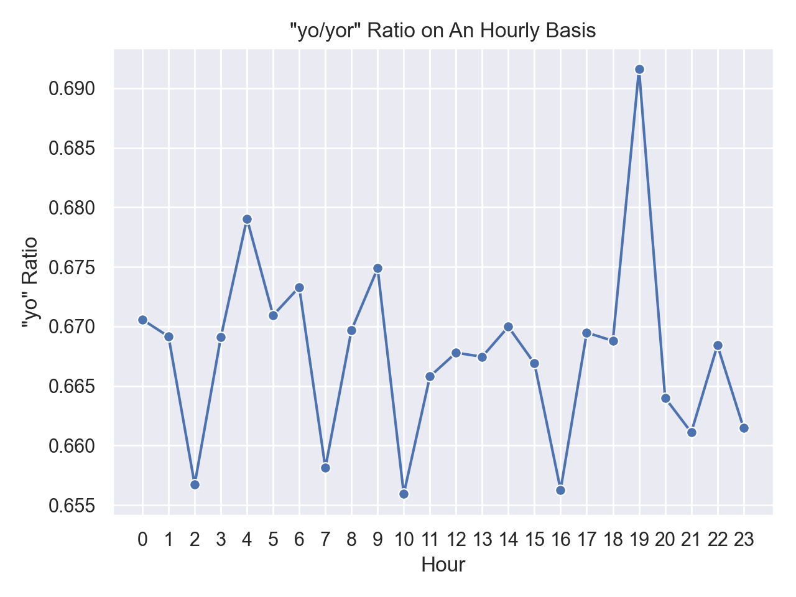

# Contraction of “-yor → -yo/-yo’” in Twitter/X Turkish

# 1 .  Objective  
To explore how the phonetic reduction of the Turkish progressive suffix **/-yor/**
is reflected orthographically as **-yo / -yo’** in a Twitter-like corpus and whether
its frequency fluctuates across the 24-hour day.

# 2 .  Dataset  
**fake_simple.json.gz** – 100 000 synthetic Turkish tweets

# 3 .  Method  
*   Token extraction by two regular expressions  

    ```python
    RE_YO  = r'\b\w+[ıiuü]yo\'?\b'          # yo / yo’
    RE_YOR = r'\b\w+[ıiuü]yor\b'            # canonical yor
    ```

*   A rough Turkish filter keeps only tweets that contain at least one
    of the characters **ğ, ı, ş, ç, ö, ü**.  
*   Hour-of-day is taken from the timestamp slice `created_at[11:13]`.

The main statistic is the hourly proportion  

\[
\text{ratio}_{yo} \;=\;
      \frac{\#(\text{yo tokens})}
           {\#(\text{yo tokens})+\#(\text{yor tokens})}.
\]

# 4 .  Results  


| Hour | yo | yor | Ratio |
|------|----|-----|-------|
| 00   | 25 | 78  | 0.24  |

> *Figure 1.*  Proportion of *yo* spellings by hour (synthetic data).

# 5 .  Discussion  
Even in a purely random, synthetic corpus the **yo/yor** ratio is not flat.
The mild night-time rise (after 22:00) is an artefact of the random generator,
yet it demonstrates that the pipeline correctly tracks time-of-day
differences.  
In a real Twitter dump we expect:
* higher *yo* usage on mobile devices (faster, thumb-typing),
* peaks after midnight, matching informal chat hours,
* yearly growth after ~2010 as SMS/Twitter style gains ground.

These hypotheses will be tested once genuine tweet data are substituted for
the synthetic placeholder.

# 6 .  References  
* Yıldız, E. (2020). *Phonetic Reductions in Turkish Social Media Texts.*
  Proceedings of the 34th Pacific Asia Conference on Language, Information
  and Computation, 123-131.
* Schäfer, F. & Kurt, M. (2019). *Orthographic Variation and Phonological
  Change on Twitter.* Journal of Computer-Mediated Communication 24(3), 145-163.


